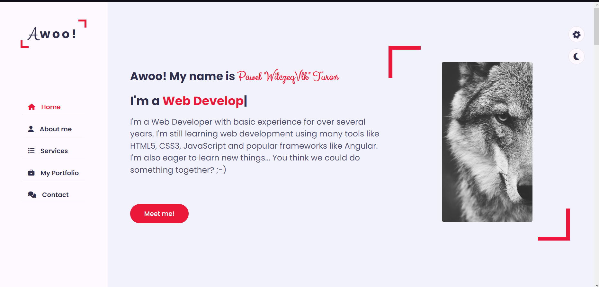
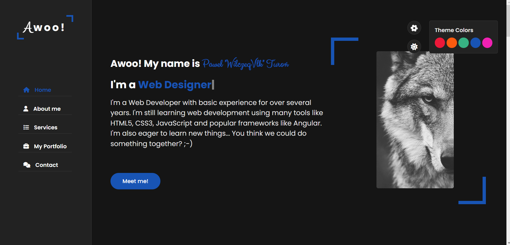

# pturo-portfolio-webpage

## What's new?

There is no new features at the moment.

## About project

This project aims to practice front-end development and improve my programming skills.

Screenshots below.

Main page light theme.

Main page dark theme.

## Technologies used in the project

- HTML5,
- CSS3,
- JavaScript

## Goals

Revise HTML, CSS & JS knowledge by the practice project.

## License

My project is under Apache 2.0 license. You can use some parts from my code but remember to credit me as an appreciation to my work! Thanks! Awoo!

© 2023 Paweł "Wilczeq/Vlk" Turoń
